# 📊 Rapport d'Avancement V3 — NEXUS ERP & Conformité CDC

> **Plateforme de Gestion Intégrée des Talents : NEXUS ERP**
> Rédigé pour : Direction & Équipe PFE
> Date de mise à jour : **11 Juin 2026**
> Auteur : Kada Abdelhamid & Antigravity AI
> Workspace : `d:\Dev\NEXUS`

---

## 1. Synthèse Globale de l'Avancement

Depuis la version précédente du rapport, le projet **NEXUS ERP** a franchi un cap décisif vers sa finalisation. Nous avons migré plusieurs modules clés du mode simulation (mock) vers une **intégration full-stack réelle** connectée au backend Spring Boot.

### 📈 Taux de Complétude par Module (CDC vs Réalité)

```mermaid
gantt
    title Taux de Complétude des Modules NEXUS ERP
    dateFormat  X
    axisFormat %s%%
    
    section RBAC & Sécurité (85%)
    Intégration Spring Security & Guards :active, a1, 0, 85
    
    section Core HR (90%)
    Profils 360°, Ségrégation, Matricules :active, a2, 0, 90
    
    section Temps & Congés (85%)
    Pointeuse, Machine à états, Console :active, a3, 0, 85
    
    section Analytics & IA (65%)
    KPIs Réels, Graphiques Recharts :active, a4, 0, 65
    
    section Chatbot & Tickets (25%)
    Widget UI, Simulation NLP :active, a5, 0, 25
```

- **Taux d'avancement global estimé : ~62%** (+2 points par rapport à la V2, avec une fiabilisation et une connexion des APIs majeures).

---

## 2. Tableau Comparatif Détaillé : CDC vs Réalisé

Le tableau ci-dessous confronte point par point les exigences du **Cahier des Charges (CDC)** avec l'état actuel de notre implémentation :

| Réf. CDC | Exigence du Cahier des Charges | Statut | Détail de l'Implémentation Réalisée |
|---|---|---|---|
| **§5.1** | **Gestion des 5 rôles natifs** | **[✓] Réalisé** | Rôles `EMPLOYEE`, `MANAGER`, `HR_ADMIN`, `IT_ADMIN`, `DIRECTION` configurés en BDD et mappés dans Spring Security. |
| **§5.1** | **Sécurité JWT & Protection des Routes** | **[✓] Réalisé** | Filtre stateless JWT fonctionnel. Ajout côté frontend du composant `<RoleProtectedRoute>` et masquage dynamique de la Sidebar. |
| **§5.2** | **Profil Employé 360°** | **[✓] Réalisé** | Identifiants professionnels et personnels complets. Remplacement des IDs techniques par des **Matricules séquentiels** (`E0001` à `E0013`). |
| **§5.2** | **Ségrégation de Données (Public/Privé)** | **[✓] Réalisé** | Champs contractuels `[P]` (salaire, contrat, adresse, etc.) filtrés au niveau de l'API et affichés de manière conditionnelle uniquement aux profils habilités. |
| **§5.2** | **Chiffrement fort des données sensibles** | **[✓] Réalisé** | Chiffrement transparent **AES-GCM-256** actif sur la colonne `rib` via un convertisseur JPA. |
| **§5.2** | **Coffre-fort Numérique** | **[~] Partiel** | Interface frontend complète (drag-and-drop, gestion des statuts de signature), mais en mode mock (pas de stockage S3/physique). |
| **§5.3** | **Pointeuse Numérique avec Géolocalisation** | **[✓] Réalisé** | Horloge temps réel, pointage `CHECK_IN` / `CHECK_OUT` et calcul des heures normales + sup connecté à la base de données. |
| **§5.3** | **Machine à États de Validation des Congés** | **[✓] Réalisé** | Système fonctionnel (`PENDING` ➔ `VALIDATED_N1` ➔ `PROCESSED_HR` ou `REJECTED`). Résolution des anomalies de transition de statut. |
| **§5.4** | **Dashboard Analytique / KPIs Réels** | **[✓] Réalisé** | Les KPIs (Attrition, Présence, Alertes formation) ne sont plus mockés. Ils sont calculés dynamiquement par le backend (`/api/v1/analytics/kpis`). |
| **§5.4** | **Prédictions IA (Absences, Attrition)** | **[~] Partiel** | Graphiques Recharts interactifs intégrés (LSTM, K-Means), mais alimentés par des algorithmes heuristiques backend simples à la place des modèles ML. |
| **§5.5** | **Assistant Intelligent (Chatbot NLP)** | **[~] Partiel** | Widget flottant persistant intégré au design. Simulation de conversation et de création de tickets RH opérationnelle. |
| **§5.5** | **Système de Ticketing avec SLAs** | **[✗] Non Recommencé**| Non implémenté en BDD ni dans le backend. |
| **§4.2** | **Qualité de Code & Tests unitaires (>80%)** | **[✗] Non Recommencé**| Seule l'ossature Spring Boot Starter Test est présente. |
| **§6** | **Pipeline CI/CD & Dockerisation Prod** | **[~] Partiel** | Docker compose actif pour MySQL 8 local. Manque les Dockerfiles multi-stage pour le déploiement final. |

---

## 3. Focus sur les Avancées Majeures Récentes

### A. Ségrégation stricte des Données [E] vs [P]
Le backend filtre désormais dynamiquement les champs sensibles dans [EmployeeProfileResponse.java](file:///d:/Dev/NEXUS/nexus-erp/src/main/java/com/dyxia/nexuserp/dto/EmployeeProfileResponse.java). Le frontend ([EmployeeProfileDetail.jsx](file:///d:/Dev/NEXUS/mon-app-react/src/components/EmployeeProfileDetail.jsx)) n'affiche la carte "Informations Contractuelles" que si l'utilisateur y a droit (données non nulles), éliminant ainsi les messages d'accès restreint inesthétiques pour les collaborateurs ordinaires.

### B. Connexion du Dashboard Analytique
Le backend expose désormais l'endpoint `/api/v1/analytics/kpis` calculé par un nouveau `AnalyticsService`. Les données de présence (taux de présence du jour basé sur les congés actifs), le risque d'attrition et les alertes formation (compétences avec niveau <= 2) sont réelles et fiables.

### C. Professionnalisation des Identifiants & Hiérarchie
Fin des IDs techniques bruts (`#73`). Chaque employé dispose d'un matricule propre (`E0001` à `E0013`) généré par le `DatabaseSeeder`. La fiche de profil remonte et met en valeur le responsable hiérarchique direct avec son matricule et son poste.

---

## 4. Backlog Restant Priorisé (Vers les 100%)

1. **Intégration du Chatbot NLP (LangChain4j + Claude)** : Brancher le widget frontend sur un orchestrateur Spring Boot connecté à l'API LLM.
2. **Backend du Coffre-Fort Numérique** : Implémenter le stockage physique et le téléchargement des fichiers PDF.
3. **Moteur PDF & Édition d'Attestations** : Automatiser la génération des fiches de paie et attestations de travail.
4. **DevOps & Tests** : Rédiger les tests unitaires et configurer la CI/CD pour finaliser le PFE.
